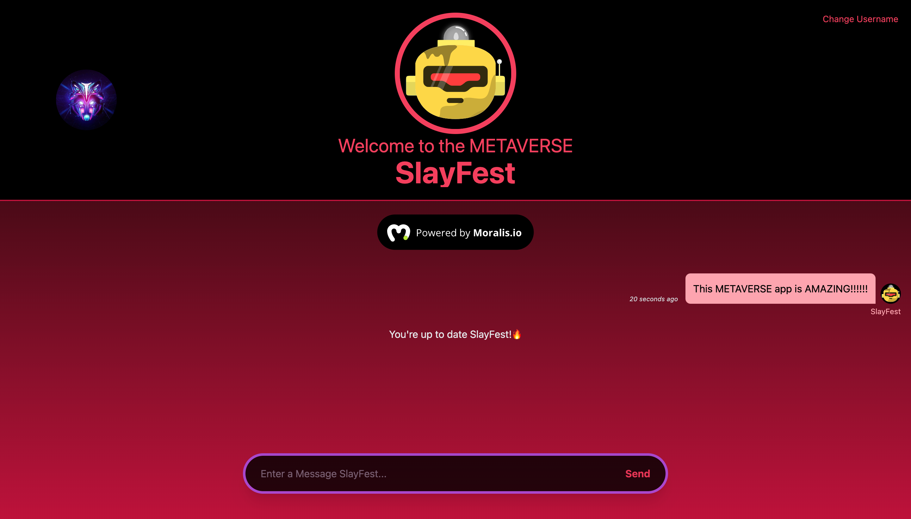

# Welcome to the METAVERSE

## Description
A metaverse app that you login with a crypto wallet (example-Metamask) and are routed to a live chat app in the metaverse. You can change your username and your avatar will change with it. Live time stamps with each message written.

## Technologies Used
* React
* JavaScript
* Tailwind
* Node 
* Moralis
* Next.js

## Preview



## Next.js + Tailwind CSS Example

This example shows how to use [Tailwind CSS](https://tailwindcss.com/) [(v3.0)](https://tailwindcss.com/blog/tailwindcss-v3) with Next.js. It follows the steps outlined in the official [Tailwind docs](https://tailwindcss.com/docs/guides/nextjs).


## How to use

Execute [`create-next-app`](https://github.com/vercel/next.js/tree/canary/packages/create-next-app) with [npm](https://docs.npmjs.com/cli/init) or [Yarn](https://yarnpkg.com/lang/en/docs/cli/create/) to bootstrap the example:

```bash
npx create-next-app --example with-tailwindcss with-tailwindcss-app
# or
yarn create next-app --example with-tailwindcss with-tailwindcss-app
```

Deploy it to the cloud with [Vercel](https://vercel.com/new?utm_source=github&utm_medium=readme&utm_campaign=next-example) ([Documentation](https://nextjs.org/docs/deployment)).

## Deployed Site
<a href='https://metaverse-challenge-lyart-eight.vercel.app/'>Welcome to the METAVERSE</a>